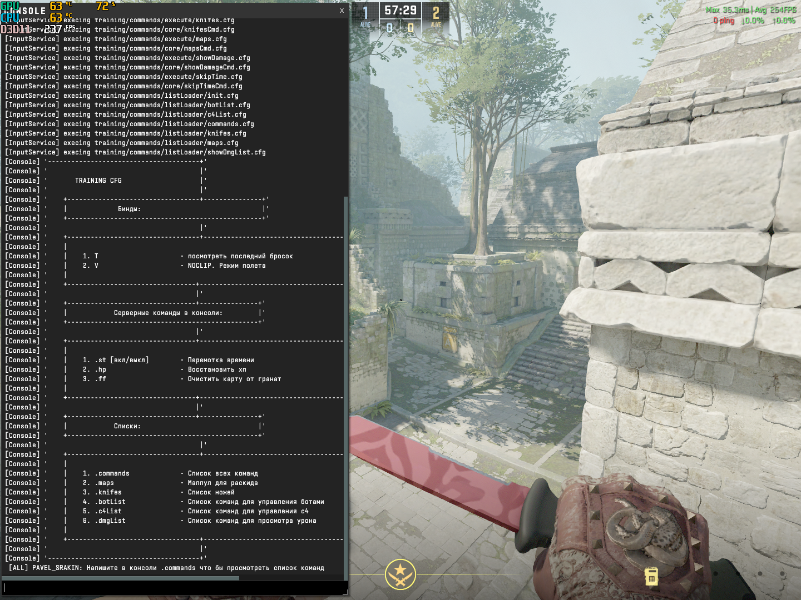
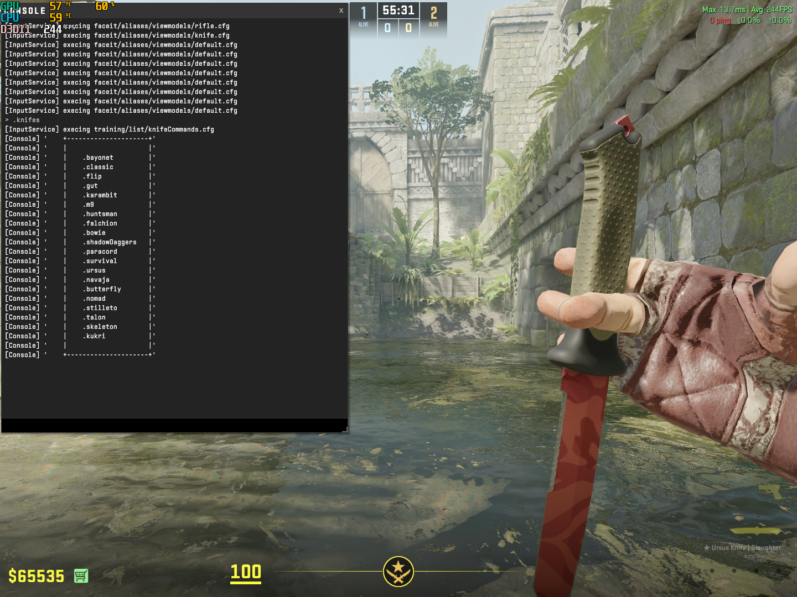

# Привет, я очень люблю counter-strike и предоставляю вам замечательный конфиг,
напичканый командами для тренировок.

<details>
  <summary>Важно, что он не изменяет никаких ваших настроек. </summary>
  Тем не менее, внутри есть бинды для noclip (безприпятственного полета) и броска последней гранаты. Если они нужны, то зайти в файл training.cfg и почитай сноски справа.
</details>

<br>
<br>

|   | Введение в главы                                        |
| :---: | :---                                                | 
| 1 | [Введение](#part-1)                                     |
| 2 | [Получение любого ножа](#part-2)                        |
| 3 | [Очищение карты и перемотка времени](#part-3)           |
| 4 | [Восстановление ХП](#part-4)                            |
| 5 | [Боты](#part-5)                            |
| 6 | [Бомба](#part-6)                            |
| 7 | [Подключение спотов для тренировки](#part-7)            |
| 8 | [Запуск и установка конфига](#part-8)                   |
<br>

---

## <a name="part-1">PART 1.</a> 
Как Я Вас встречаю?
При загрузке конфига, расписаны основные методы работы с ним



**Весь процесс взаимодействия будет происходить с помощью консоли, но не беспокойся об этом. 
Команды легкие и всегда есть подсказки если что-то забудешь. А если этого мало, то можно забиндить часто используемые**

---

## <a name="part-2">PART 2.</a> 

Начнем со всеми любимого - это список доступных ножей. 
Я очень старался что бы найти все, которые будут хоть как-то кому-то интересны и пришел к такому листингу:


Захотел нож? Открывай консоль и пиши `.flip`, `.gut` или `.m9`. 
После свапа оружия он будет уже красоваться в твоих сальных пальчиках)))

---

## <a name="part-3">PART 3.</a> 
> Вопрос:
> О, Боже, я миснул смок и он упал мне прямо перед ебалом, и теперь мне нужно ждать 18 секунд пока это говно разревилиться... ;(  
> Или нет?
> > Ответ: Рад сообщить, что - НЕТ!  
> > С помощью команды `.skiptime` ты можешь ускорить время на сервере и ждать не 18 секунд, а две.  
> > А если и это не устраивает, то пиши `.clearmap` - в этом случае все гаранаты ревилятся моментально. Делай, гаджишка 

---

## <a name="part-4">PART 4.</a> 
> Вопрос: 
> Хочу чекнуть сколько наносит моя связка из хае и молика, но осталось 20хп и так впадлу умирать что бы зачекать комбу. 
> А если я ей мисну, то придется умирать снова что бы не миснуть. 
> Е-мае. Вот эти телодвижения Питерские меня не устраивают. Можно че-то выдумать?
> > Ответ:
> > Братанчик, я тебя прекрасно понимаю. Введи в консоль `.heal` и у всех на твоем сервачке хпшка восстановится до сотки. 
Пользуйся, рад быть полезным!

---

## <a name="part-5">PART 5.</a> 
> Вопрос:
> А что есть для управления ботами. Типо это вообще возможно, а то они нахуй крутятся, вертятся и не слушаются
> > Ответ:
> > Чекни `.botList`. Они могут присесть, встать и спавниться простыми алиасами. + ко всему они всегда смотрят в одну сторону [на тебя]

---

## <a name="part-6">PART 6.</a> 
> Вопрос:
> А с пачкой что можно наворотить?
> > Ответ:  
> > Глянь `.c4List`. Можно выставить таймер бомбы, наспавнить ее, ну и повзрывать карту

---

## <a name="part-7">PART 7.</a> 
> Вопрос:  
> Слышь, чепух, я сюда за раскидами пришел, че ты мне втираешь? Иди нахуй.
> > Ответ:
> > Во-первых сам иди нахуй, а во-вторых:  
> > Тренировка предоставляет два режима гранат. За КТ и Т сторону  
> > Что бы начать практиковаться, надо выбрать карту, которую ты загрузил. Допустим это будет anubis.  
> > Тогда я пишу в консоли: `.de_anubis`, далее выбираю сторону `.ct` и вижу подробное объяснение с тем что тут вообще есть.

Выглядит в консоли это вот так:
```cfg
> # вводим текущую карту. В нашем случае анубис
> .de_anubis
[InputService] execing .aliases/training/maps/de_anubis/main.cfg # <- сообщение о том что конфиг анубиса загружен
 
Теперь вам доступны раскиды гарант на карте de_anubis # <- приветствие вместе с загруженным конфигом 
Что бы начать раскид, введите сторону в консоль: .ct или .t # <- и напоминание о том какие команды дальше ввести
# <- вводим КТ
> .ct
[InputService] execing .aliases/training/maps/de_anubis/ct.cfg # <- сообщение о том что раскид за КТ доступен
```

---

## <a name="part-8">PART 8.</a> 
> Вопрос:  
> Хорошо, ты меня заинтриговал. Как это запустить?
> > Ответ: Да все на самом деле проще некуда:
> > 1. Копируешь директорию `training` и вставляешь в папку с игрой по такому пути:  
> > - `game/`
> > - - `csgo/`
> > - - - `cfg/`  
> > 2. Копируешь файл example.training.cfg из тренировки и помещаешь в `game/csgo/cfg/training.cfg` -> названия должны совпадать
> > > На этом самая важная часть настройки закончена. Игра теперь знает что у нее есть конфиг;  
> > 3. В игре запускаешь тренировочный режим и карту, которая нужна;
> > 4. после выбора стороны пишешь в консоли `exec training`;  
> > 5. `Учишь гранаты с удовольствием, а главное - бесплатно!`;

---

## <a name="part-7">PART 7.</a> 
> Вопрос:  
> О бля э бля а бля у бля я забыл че там надо было вводить? 
> > Ответ: На такой случай ты можешь или запустить конфиг заного или ввести `.commands`. 
Эта команда дружелюбно подскажет тебе список всех приколюх о которых я писал.

---

## <a name="part-8">PART 8.</a> 
Быстрые команды-алиасы :
- `.clearmap` - есть более быстрые и простые команды. Допустим `.ff` или `.clear` 
- `.heal`     - `.hp`
- `.skiptime` - `.st` или `.skip`

---

## <a name="part-9">PART 9.</a> 
В данный момент раскиды есть далеко не всех картах. Я сейчас активно работаю над этим.  
Что бы порадовать таких работяг как вы.  

Карты с инста гранатами:
1. **.de_ancient**
2. **.de_anubis**
3. **.de_dust2**
4. **.de_inferno**
5. **.de_mirage**
6. **.de_nuke**
7. ~~**de_train**~~
7. ~~**.de_vertigo**~~

Если вам нравится проект и вы хотите помочь молодому энтузиасту я буду очень благодарен  

> qr для хелпы: 

