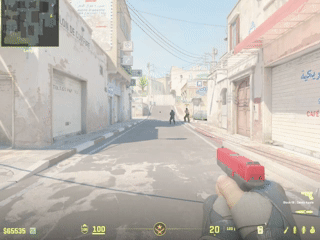
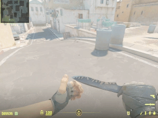
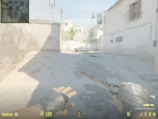
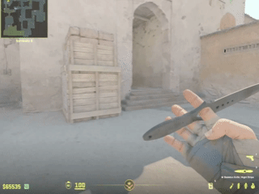
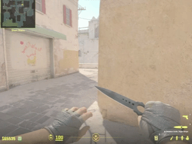
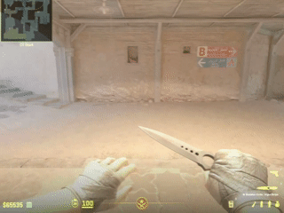

# 👋 Hello! I'm your Counter-Strike training config.

🎯 **A wonderful config, packed with commands for training**

---

## 📚 Contents

| # | Chapter |
|:---:|:---|
| 1️⃣ | [Introduction](#part-1) |
| 2️⃣ | [Getting the Knife](#part-2) |
| 3️⃣ | [Clearing the Map and Rewinding Time](#part-3) |
| 4️⃣ | [HP Regeneration](#part-4) |
| 5️⃣ | [Bots](#part-5) |
| 6️⃣ | [The Bomb](#part-6) |
| 7️⃣ | [Connecting Training Spots](#part-7) |
| 8️⃣ | [Quick Commands](#part-8) |
| 9️⃣ | [Available Maps](#part-9) |
| 🔟 | [Manual Configuration Installation](#part-10) |
| 1️⃣1️⃣ | [Easy Configuration Installation](#part-11) |

---

## <a name="part-1">🎮 PART 1. Introduction</a>

**How ​​do I greet you?**

When loading the config, the basic methods for working with it are described 🎯

<a name="part-start"></a>

💡 *All interaction occurs through the console. Don't worry - the commands are simple, and hints are always available!*

---

## <a name="part-2">🔪 PART 2. Knives</a>

**Let's start with everyone's favorite - a list of available knives!**

**How ​​to use:**
```
.dropon # Allow knife drops
.batterfly-drop # Create a knife
.dropoff # Disable knife drops
```



---

## <a name="part-3">⏱️ PART 3. Time and Map</a>

> ❓ *"Oh my god, I missed the smoke and now I have to wait 18 seconds..."*

**There's a solution!**

🚀 **`.skiptime`** - speed up server time (instead of 18 seconds → 2 seconds)

🧹 **`.clearmap`** - clear the map instantly (all grenades are revitalized)


---

## <a name="part-4">❤️ PART 4. Health</a>

> ❓ *"I want to check the hae + hammer combo, but I have 20 HP left..."*

**The solution is simple:**

💊 **`.heal`** or **`.hp`** - restore 100 HP to everyone on the server

🎯 *Use it and don't die everyone One!*


---

## <a name="part-5">🤖 PART 5. Bots</a>

> ❓ *"The bots are spinning and won't listen..."*

**Bot Controls:**

📋 **`.botList`** - List of commands for bots

✨ *Bots can crouch, stand up, spawn, and always look at you!*


---

## <a name="part-6">💣 PART 6. Bomb</a>

> ❓ *"What can you do with a pack?"*

**Bomb Possibilities:**

📋 **`.c4List`** - a list of commands for working with the bomb

⚡ *You can set a timer, spawn a bomb, and detonate the map*

---

## <a name="part-7">📍 PART 7. Practice Spots</a>

> ❓ *"I came here for the scatters!"*

**How ​​to use the spots:**

1. Select a map: `.de_anubis`
2. Select a side: `.ct` or `.t`
3. Get detailed instructions!

**Console example:**
```cfg
.de_anubis
[InputService] execing .aliases/training/maps/de_anubis/main.cfg

.ct
[InputService] execing .aliases/training/maps/de_anubis/ct.cfg

.spawn1
[your model will appear on the current de_anubis map at spawn for ct number 1]
```


---

## <a name="part-8">⚡ PART 8. Quick Commands</a>

> ❓ *"Forgot your commands?"*

**Command Help:**
- **`.commands`** - list of all commands

**Quick Commands Aliases:**
```
.clearmap ↔ .ff ↔ .clear # Clear the map
.heal ↔ .hp # Restore HP
.skiptime ↔ .st ↔ .skip # Rewind time
```

---

## <a name="part-9">🗺️ PART 9. Available Maps</a>

**Maps with Insta Grenades:**

| Maps | Ready to use |
|---|---|
| `.de_ancient` | ✅ |
| `.de_anubis` | ✅ |
| `.de_dust2` | ✅ |
| `.de_inferno` | ✅ |
| `.de_mirage` | ✅ |
| `.de_nuke` | ✅ |
| `.de_train` | ✅ |
| `.de_vertigo` | ⏳ |
| `.de_cobblestone` | ⏳ |

---

## <a name="part-10">⚙️ PART 10. Manual Installation</a>

> ❓ *"How do I run this?"*

**Step-by-step installation:**

1. Go to the latest releases <a href="https://github.com/ESCA7A/training-cs2-nades/releases">[click]<a>
2. Download the Source code archive
3. Right-click the archive -> extract to the current folder
4. 📁 Copy the extracted directory to the game folder along the path cs:
```
<path_to_cs2>/csgo/cfg/
```

5. 📄 Go to the `training-cs2-nades-Z.X.C/training` folder. Copy `example.training.cfg` and move it to the /cfg folder.

6. 🔄 In the cfg folder, rename the file `example.training.cfg` to `training.cfg`

7. Open training.cfg in a text editor and replace the paths:

7.1. `exec training/main.cfg;` to `exec <training-cs2-nades-Z.X.C>/training/main.cfg;`

7.2. `exec_async training/helloworld.cfg;` -> `exec_async <training-cs2-nades-Z.X.C>/training/helloworld.cfg;`

8. 🎮 Launch the game on any map and enter `exec training` in the console - [Visual in-game launch](#part-1)

9. 🎉 *Learn grenades with pleasure, and most importantly - for free!*

---

## <a name="part-11">⚙️ PART 11. Easy Installation</a>

> ❓ *"I'm too lazy. How do I run this?"*

**Step-by-step installation:**

1. Go to the latest releases <a href="https://github.com/ESCA7A/training-cs2-nades/releases">[click]<a>
2. Download the Source code archive
3. Right-click the archive -> extract to the current folder
4. 📁 Copy the extracted directory to the game folder along the path cs:
```
<path_to_cs2>/csgo/cfg/
```

5. 🚀 Run cs-nades.exe
<details>
<summary>Learn more about cs-nades.exe</summary>
<a href="https://github.com/ESCA7A/cs2-nades-runner)">Go to source</a>
</details>

6. 🎮 Launch the game on any map and enter `exec training` in the console - [Visual in-game launch](#part-1)

7. 🎉 *Learn grenades with pleasure, and best of all - for free!*

---